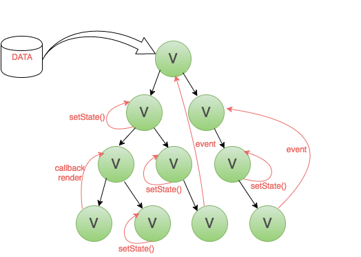
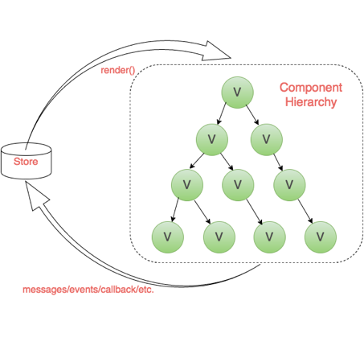

## 欢迎大家来参加本次分享👏👏👏

# 前端状态管理

## 提纲

 通过本次分享，你将了解：<!-- .element: class="fragment" data-fragment-index="1" -->

>  - 简短的前端框架发展历史
>  - 几个典型的前端框架的编程方式和差异
>  - 前端状态的概念
>  - 为何要做前端的状态管理
>  - 现下主流的状态管理工具
>  - 如何使用Flux做状态管理
<!-- .element: class="fragment" data-fragment-index="2" -->

后期分享：

>    - 几大主流状态管理的基本原理
>    - Redux, VueX, Mobx, MST异同
>    - 各自适合的业务场景
>    - MST在标注平台中的实践

## 状态的概念

- 软件工程中的一个基本概念
- 因为外部的一些影响或刺激而呈现出不同的状态
- 用状态来表示这些动态行为的结果

<!--
Note 其实状态这个名词不是前端特有的，它本身也是软件工程中的一个基本概念。它意味着一种对象因为外部的一些影响或刺激而呈现出不同的状态以及相应的响应和活动。我们用状态来表示这些变化的动态行为的结果。
-->

#### 页面演化过程

- 早期是静态页面
- Javascript诞生，可以灵活操纵dom。
- 静态页面有了“状态”

- [动态页面Demo](https://frontarm.com/demoboard/?id=3005830a-7827-41cf-a421-71fd7b2b0b3a)

<!--
Note 我们知道，在前端发展初期，网页其实只是一些静态的html文件，任何小的改动都意味着一个新的页面。感谢浏览器的鼻祖网景公司，不仅打开了互联网的新视界大门，还创造了近30年改变世界的一门语言（之一）——javascript。javascript可以灵活的操纵dom，他让页面动起来的那一刻，在我的理解里，它就有了“状态”。当然，之后iframe和AJAX技术的出现，使页面又多了异步加载的能力，配合页面的局部刷新，给用户体验带来质的飞跃。这成为前端也促进和吸引了更多优秀的开发人员关注前端开发的技术改变，前端技术才得以飞速发展。
-->

#### 事件驱动的前端框架
- jQuery
 - 特点：事件驱动，简单灵活，上手容易
 - 问题：复杂项目，大量重复的dom操作，冗余、难以维护
- 事件驱动的开发方式

- [jQuery Demo](https://frontarm.com/demoboard/?id=7ad29018-7b8a-4dd2-9abd-cf74dc4e5660)

<!--
Note 早期的前端框架如jQuery，通过直接操纵dom来响应页面的变化。
我这有一个相关的示例，大家可以直观的看一下
这种靠事件驱动的开发方式，简单灵活，但是遇到复杂的应用，项目很难维护。
-->

### 把简单的事情做的不简单

  将机械重复的操纵dom的工作交给框架!<!-- .element: class="fragment" data-fragment-index="1" -->

  <!-- .element: class="fragment" data-fragment-index="2" -->

  <!--
  Note 现代前端得以高速发展，感谢优秀的前端开发者，喜欢将简单的事情做的不简单。既然操纵dom机械又重复，不如将这项工作交给框架。如图所示，开发人员只需要关心页面数据的变化逻辑，然后改变虚拟dom的结构，至于最终如何反应到真实dom上，由框架帮我们完成。
  -->

#### 高级前端框架

<!-- .element: class="fragment" data-fragment-index="1" -->

<!--
  Note 这些前端框架都可以使开发人员无需直接参与dom变化的工作。
  回到状态这个话题，在开发人员拥有了javascript这个神器，让页面由静态变成了动态，页面有个状态。到后来，人们从手动改变dom解脱出来，由数据的变化驱动真实dom的变化，而这个促使页面发生变化的数据，就是我们今天真正要讨论的“状态”。
-->

### 小结

>  由数据的变化驱动真实dom的变化，而这个促使页面发生变化的<b style="font-size: 60px">数据</b>，就是我们今天真正要讨论的 <b style="font-size: 60px">状态</b>。
<!-- .element: class="fragment" data-fragment-index="1" -->

## 数据驱动的前端框架

<!--
Note 上面我们提到的前端框架还有统一的名字：数据驱动的前端框架。
-->

#### 各种模式
<!-- .element: class="fragment fade-in" data-fragment-index="1" -->

<!-- .element: class="fragment fade-in" data-fragment-index="2" -->

<!--
Note 如果大家与这类框架打过交道，不免也会对一些名词很熟悉，如MVC，MVVM，MVP，MV*。先简单给大家介绍一下这几个概念。MVC这个概念大家应该都知道，并不新鲜，因为他起源于后端。M-model，对应与数据库打交道的数据层；V-view，对应前端展示层，早期后端会给前端提供一些静态的html页面；C-controller，专门处理数据和视图层相互关联的逻辑。
-->

#### SPA = Sigle Page Application

<!--
Note 后面随着SPA技术的发展（Sigle Page Application），前后端技术分离，前端也开始像后端学习结构模式，这才把MVC这一套搬到了前端。M和V分别可以理解为数据层和视图层，另外的C也好，VM也好，whatever，都大同小异，都是处理连接数据层和视图层的逻辑。
-->

<!-- .element: class="fragment fade-in" data-fragment-index="1" -->

<!-- .element: class="fragment fade-in" data-fragment-index="2" -->

<!--
Note MVC和MVVM最大的区别是，MVC的C层可以对应多了MV的逻辑。而VM只对应单独的V和M。本质都是建立一个抽象层，操纵V中抽象出的数据对象使V和M双向互动。
-->

#### MVC模式的代表框架

- BackBone.js
- Extjs 早期

#### MVVM模式的代表框架

- Ember.js
- Knockout.js
- Angular.js

[Angular Demo](https://codesandbox.io/s/angular?file=/src/app/app.component.ts)

<b style="font-size:100px">UI = f(data)</b>

data -> state
<!-- .element: class="fragment fade-in" data-fragment-index="2" -->
<!--
Note 10年左右，Facebook团队对市面上这类框架依然不满意。数据驱动的实质其实可以抽象为一个简单的公式：UI=f(data)
通过监听数据的变化，解析JS代码直接生成dom。
现有的MVX模型，基本上是通过开发人员自己去定义html模板，数据变更模板中的数据。页面变更，通过直接插入删除模板。即使模板中只有部分数据发生了变化，但整个模板都要重新去渲染。
react中，function的参数data称为state，也译为状态。
-->

### React
[React Demo](https://frontarm.com/demoboard/?id=0471cb81-249d-4c2c-88de-d465d40dac72)

<!--
Note 可以看出，组件状态变更，需要手动调用setState方法。
点击一下compiled，可以看到React的实际代码结构。通过调用createElement方法，框架帮我们创建虚拟dom。<>尖括号只是React提供的语法糖，开发起来更像是在写html。每次页面变更，其实是先去更新保存在缓存中的虚拟dom，更新好之后再将变更片段插入到真实dom中。
从这个例子可以很清楚的看出，React与MV*框架的不同。它没有一个清晰的数据层。

-->
 

## 为什么要讲状态管理？
<!--
Note 其实在MVC，MVVM时代，框架层已经很好的为我们划分一个单独的数据层。但React这个库并没有给我们约束数据的形态，就像官方所说的，它只是一个视图层的库。由于开发人员的水平参差不起，再加上复杂的业务逻辑，状态不免会管理混乱。
另外值得一提的是，React是单向数据流，也就是说，子组件中要想获得父组件中的状态，只能通过props参数的形式，从父级一层层传递到自组件中。如图所示：
-->

<!--
Note 如果我们的页面比较复杂，又没有用任何数据层框架的话，就是图片上这个样子：交互上存在父子、子父、兄弟组件间通信，数据也存在跨层、反向的数据流。层次多的兄弟间通信要向上回溯到公共父亲节点，再传递下来，路径漫长。这样的话，我们维护起来就会特别困难。
总结一下react的问题：
-->

### React的问题

- 是一个视图层的库
- 任何视图组件中都可能存在改变数据层的代码
- 出现问题将会很难追溯
- 由父组件通过 props 的方式传给子组件，组件之间产生强耦合

<!--
Note 
  React 只是一个视图层的库，并没有对数据层有任何的限制，换言之任何视图组件中都可能存在改变数据层的代码，而过度放权对于数据层的管理是不利的，另外一旦数据层出现问题将会很难追溯，因为不知道变更是从哪些组件发起的。另外，如果数据是由父组件通过 props 的方式传给子组件的话，组件之间会产生耦合，违背了模块化的原则。
  那么我们理想的应用状态是什么样呢？看下图：
-->

<!--
    架构层面上讲，我们希望UI跟数据和逻辑分离，UI只负责渲染，业务和逻辑交由其它部分处理，从数据流向方面来说, 单向数据流确保了整个流程清晰。

    从这张图，可以看出，如果我们有一个脱离view层的状态仓库，并且交互变化时可以发出一个信号通知仓库，仓库根据信号更新状态，状态变更之后再重新通知跟变更的状态相关联的页面进行更新。另外，还有在初始的时候，存放每一个信号对应仓库中哪些状态的变更或者说是仓库中的状态如何变更的信息。
    我们把这个过程再抽象一下，可以简单画出下面这张图。
-->

<!--
Note 如果这套流程大家想明白了之后呢，要恭喜大家，聪明的大脑都是相似的，Facebook团队当时也是这么想的，把图中的几个概念换一下，就是FB提出的Flux状态管理思想。如图：
值得注意的是，图上的每个组件间消息传递都是单向。也就是说，view不能直接去修改store中的数据。单向数据流确保了流程的清晰，也方便状态变更的可追溯性。

-->

## 现下主流的状态管理工具
Redux，VueX，MobX，MST
<!--
Note 其他的状态管理框架还有VueX，Mobx，MST。他们每个都有自己的特色和应用的场景。因为在坐的大多也许没有什么前端开发经验，今天我就不细展开，接下来先带大家简单了解一下最基本的Flux的代码设计实现。后面大家还感兴趣的话，可以接着跟大家分享一下几大主流状态管理库的实现原理，异同，以及各自适合的业务场景。
-->

### 如何使用Flux做状态管理

核心概念： Dispatcher

<!--
Note action概念指的是一种javascript对象，保存消息类型以及对应需要传递的消息数据。action = {actionType, payload}
store用于保存数据状态，同时响应事件并更新数据。
view负责订阅store中的数据，并使用这些数据渲染响应页面。
dispatcher调度员，它来广播事件并注册回调。
-->

[Flux Demo](https://frontarm.com/demoboard/?id=50535c10-cbe1-4faa-a6cb-c7531c853591)

## 以上是本次全部分享
## 🌺感谢倾听🌺